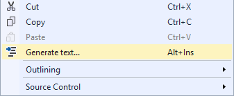

# Text Generator

Download the extension at the
[VS Gallery](https://visualstudiogallery.msdn.microsoft.com/4d809607-87dd-445c-8cd4-585da67c6beb)
or get the
[nightly build](http://vsixgallery.com/extension/0007e9e3-b11a-4d10-8565-9c6ce2ccc286/)

------------------------------------------

A Visual Studio extension for generating dummy text.

## How it works
Simply right-click in any editor in Visual Studio and
select **Generate text...**

That will open this little dialog which allows you to
specify a vocabulary and how many words to insert.

## Vocabularies
It's not just _lorem ipsum_ text that is supported, but a
whole bunch of other vocabularies from the
[NLipsum](https://github.com/alexcpendleton/NLipsum)
project:

- Lorem Ipsum (Lipsum) (of course)
- Childe Harold's Pilgrimage (Lord Byron)
- Decameron - Novella Prima (Giovanni Boccaccio)
- Faust (Goethe), German
- In der Fremde (Heinrich Heine), German
- Le Bateau Ivre (Arthur Baudelaire), French
- Le Masque (Arthur Rembaud), French
- Nagyon fáj (József Attila), Hungarian
- Ómagyar-Mária siralom (Ismeretlen), Hungarian
- Robinsono Kruso (Daniel Defoe), Esperanto
- The Raven (Edward Allen Poe), English
- Tierra y Luna (Federico García Lorca), Spanish